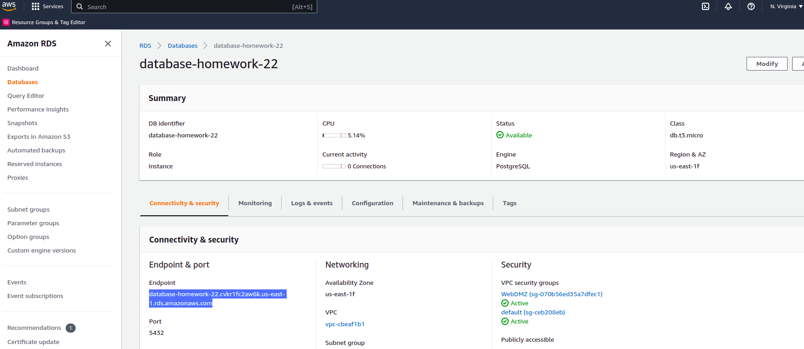
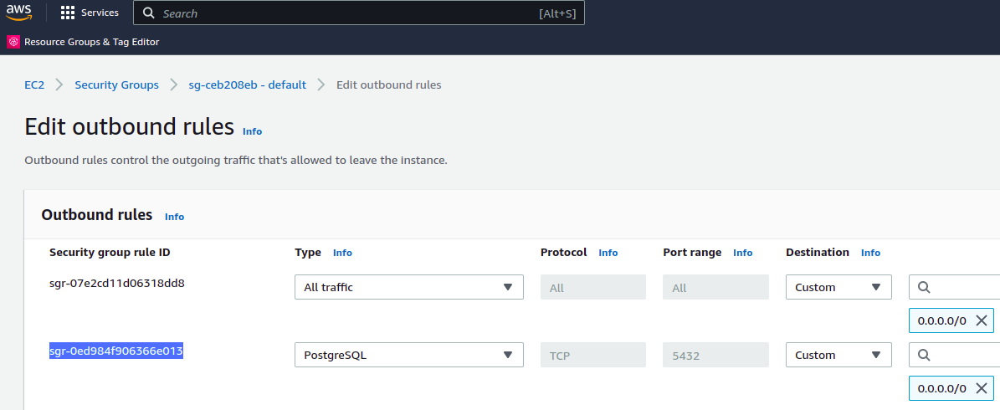
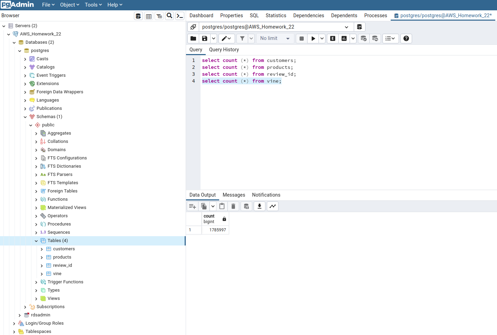

# Big-Data-ETL Challenge - Video Game Reviews (Amazon)

Module 22 Challenge - Big-Data-ETL using PySpark and AWS RDS database (Postgres)

## Background

In this project, the aim is to bring the knowledge of ETL and implement a solution runing on cloud.
The scope of this analysis is to consider the database available by Amazon, which brings information about product reviews and feedback ([Amazon Reviews](https://s3.amazonaws.com/amazon-reviews-pds/tsv/index.txt)).

Many of Amazon's shoppers depend on product reviews to make a purchase. Amazon makes these datasets publicly available. They are quite large and can exceed the capacity of local machines. One dataset alone contains over 1.5 million rows; with over 40 datasets, data analysis can be very demanding on the average local computer.

This Project is organised in two parts. Part 1 is initially completed here, and Part 2 is optional for a further development in order to strengthen new skills.

-   **Part 1:**  Extract two Amazon customer review datasets, transform each dataset into four DataFrames, and load the DataFrames into an RDS instance.
    
-   **Part 2:**  Extract two Amazon customer review datasets and use either SQL or PySpark to analyze whether reviews from Amazon's Vine program are trustworthy.

## Process Steps

This Challenge considers the following main process steps:

1) Configure AWS RDS (Postgres instance), considering to setup public access and security group open for Postgres inbound/outbound traffic under port 5432.

	

2) Create the schemas as per `schema.sql` file located in the Resources folder.

3) Implement the ETL using [Google Colab](https://colab.research.google.com/).

4) Data is loaded to AWS RDS (Postgres)

## References

Amazon Customer Reviews Dataset. (n.d.). Retrieved February 17, 2023, from: [https://s3.amazonaws.com/amazon-reviews-pds/readme.html](https://s3.amazonaws.com/amazon-reviews-pds/readme.html)